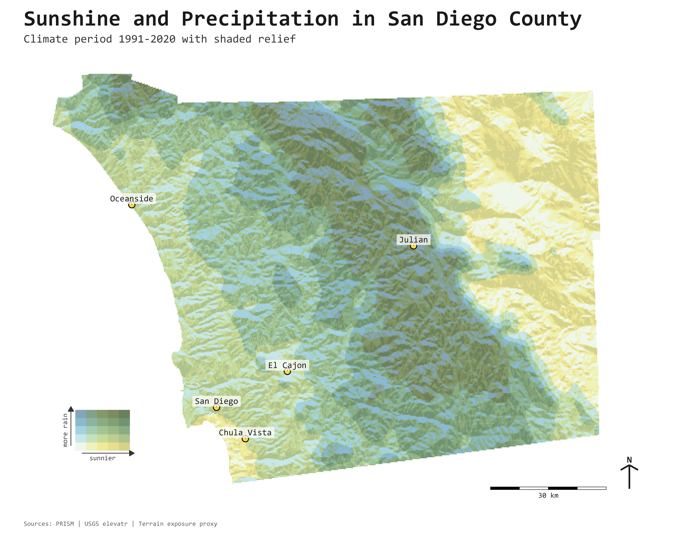

# Sunshine + Precipitation Relief Map (R)



This project generates a high-resolution terrain map that combines:

- PRISM precipitation normals (`ppt`, 800m, 1991-2020)
- A sunshine proxy derived from terrain exposure (aspect + slope)
- Hillshade-based relief for topographic texture

The script builds a bivariate (rain vs. sunshine) color map, adds cartographic elements (legend, north arrow, scale bar), and exports a final PNG.

## What the script does 

1. Reads a boundary polygon (GeoJSON) for the target area.
2. Downloads and processes DEM terrain data for that boundary.
3. Downloads PRISM precipitation normals and clips to the same extent.
4. Normalizes/stretches both rain and sunshine layers.
5. Combines them into a bivariate color surface over shaded relief.
6. Writes a high-resolution output map to `outputs/`.

## Quick start

1. Put your boundary file in `data_raw/boundary/` (GeoJSON).
2. Open `sdTerra.R` and set top-level options if needed (`area_name`, output path, etc.).
3. Run:

```r
source("sdTerra.R")
```

## Inputs

- Boundary: `data_raw/boundary/*.geojson`
- Optional labels CSV (if used): columns `name`, `lon`, `lat`

## Required R packages

- `sf`
- `terra`
- `elevatr`
- `ggplot2`
- `prism`

Install once with:

```r
install.packages(c("sf", "terra", "elevatr", "ggplot2", "prism"))
```